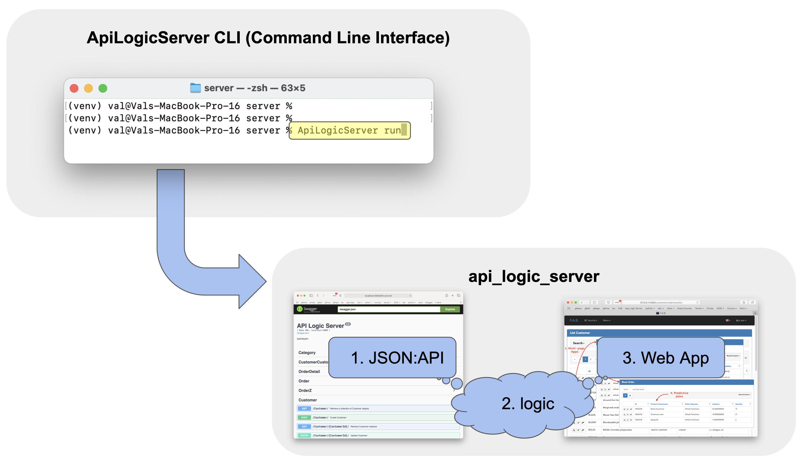

# API Logic Server

There is widespread agreement that APIs are strategic
to the business, required for mobile apps and internal
/ external systems integration.

The problem is that they are time-consuming and costly to develop.
This reduces strategic business agility.

API Logic Server provides exceptional strategic business agility,
by creating an executable server for a database, instantly.

As illustrated below, the ```ApiLogicServer CLI``` (command line interface) creates an **API Logic Server,**
from your database.  An Api Logic Server consists of these features:


| Feature | Using   | Providing  |
| :-------------- |:--------------| :------| 
| 1. JSON:**API** and Swagger     | [SAFRS](https://github.com/thomaxxl/safrs/wiki) | APIs that clients can configure<br>to **reduce network traffic** |
| 2. Transactional **Logic**| [Logic Bank](https://github.com/valhuber/logicbank#readme) | *Spreadsheet-like Rules* are **40X more concise** <br>Compare Check Credit with [legacy code](https://github.com/valhuber/LogicBank/wiki/by-code)  |
| 3. Basic **Web App** | [Flask App Builder](https://flask-appbuilder.readthedocs.io/en/latest/), <br>[fab-quickstart](https://github.com/valhuber/fab-quick-start/wiki) | Instant **multi-page, multi-table** web app<br>for back-office admin, and prototyping |
 
This **declarative approach** is based on standard Python tooling,
and can be [installed](#Installation) and customized with standard approaches as described below.

# Quick Start - Create and Execute
With a single command, create and run a
[logic](#logic)-enabled
[JSON:API](#api-safrs-jsonapi-and-swagger) and
[web app](#basic-web-app---flask-appbuilder) for your database:

<figure></figure>

As illustrated above, the system operates as follows:
* You run the ApiLogicServer CLI:
```
ApiLogicServer run  # you can also create, without execution
```
> The ```db_url``` parameter defaults to a supplied [sample database](../../wiki/Sample-Database).
Specify a [SQLAlchemy url](https://docs.sqlalchemy.org/en/14/core/engines.html)
to use your own database.

* The CLI introspects your database to create and __run__ an ```api_server_project```, which consists of:

    1. Your ___API___, available in Swagger
    
    2. With underlying ___logic___
    
    3. And a ```basic_web_app```


### Customizable Project
The ApiLogicServer CLI also __created__ a
[*customizable* ```api_server_project``` Project](../../wiki/ApiLogicServer-Guide):

<figure></figure>

After customization, your ```api_logic_server``` project can be re-executed (without creating).
To run it:
1. Specify a proper ```venv``` (virtual environment)
   
   * The one used for ApiLogicServer install is fine, or you can use a project-specific
    [virtual environment](../../wiki/ApiLogicServer-Guide#environment)
    
2. Then:

```
python api_logic_server_run.py
python ui/basic_web_app/run.py
```


# Features

### API: SAFRS JSON:API and Swagger

Your API is instantly ready to support ui and integration
development, available in swagger:

<figure></figure>

> Customize your API: edit **```api_logic_server_run.py```**, and see [Customizing](../../wiki/ApiLogicServer-Guide#customizing-apilogicprojects)

### Logic

Transactional business logic - multi-table derivations and
constraints - is a significant portion of database systems,
often nearly half.  Procedural coding is time-consuming
to develop and maintain, reducing business agility.

ApiLogicServer integrates Logic Bank, spreadsheet-like rules
that reduce transaction logic by 40X.
Logic is declared in Python (example below), and is:

- **Extensible:** logic consists of rules (see below), plus standard Python code

- **Multi-table:** rules like ``sum`` automate multi-table transactions

- **Scalable:** rules are pruned and optimized; for example, sums are processed as *1 row adjustment updates,* rather than expensive SQL aggregate queries

- **Manageable:** develop and debug your rules in IDEs, manage it in SCS systems (such as `git`) using existing procedures

The following 5 rules represent the
[same logic](https://github.com/valhuber/LogicBank/wiki/by-code)
as 200 lines of Python:
<figure></figure>

> Declare your logic by editing: **```logic/logic_bank.py```**


### Basic Web App - Flask Appbuilder

UI development takes time.  That's a problem since
* Such effort may not be warranted for admin "back office" screens,
and
  
* [Agile approaches](https://agilemanifesto.org) depend on getting _working
software_ soon, to drive _collaboration and iteration_.

ApiLogicServer CLI therefore creates working software _now:_
multi-page, multi-table applications as shown below:

1. **Multi-page:** apps include 1 page per table

2. **Multi-table:** pages include ``related_views`` for each related child table, and join in parent data

3. **Favorite fields first:** first-displayed field is "name", or `contains` "name" (configurable)

4. **Predictive joins:** favorite field of each parent is shown (product *name* - not product *id*)

5. **Ids last:** such boring fields are not shown on lists, and at the end on other pages

<figure></figure>

> Customize your app by editing: **```ui/basic_web_app/app/views.py```**

> Before running, you must [Create Admin Data](../../wiki/Working-with-Flask-AppBuilder) for Flask App Builder (except for Northwind, which is pre-created).


# Installation
Caution: Python install is rather more than running an installer.
Use this page to [Verify / Install Python](../../wiki/Python-Verify-and-Install).

Then, install the ApiLogicServer CLI in the usual manner:

```
virtualenv venv
source venv/bin/activate   # windows venv\Scripts\activate
pip install ApiLogicServer
```

# Learning
Take the [tutorial](../../wiki/Tutorial) to run your locally installed software.

If you'd like to try it with no install on the Cloud, use [this version of the Tutorial](https://github.com/valhuber/ApiLogicServerTutorial#readme).

# Project Information

### Status
Pre-Alpha / Technology Preview - just entering test.

Initially released 1/19/2021, the project is beginning to stablize:

* The [default Northwind project](../../wiki/Sample-Database) is working with for both the API and the web app,
  with pre-created logic (good to explore for examples)
  

*   We have tested several sqlite databases, and several MySQL databases -
    see [status here.](../../wiki/Testing)
    These are successfully creating / executing the API and the web app.

We are tracking [issues in git](https://github.com/valhuber/ApiLogicServer/issues).

### Acknowledgements

Many thanks to

- Mike Bayer, for SQLAlchemy
- Thomas Pollet, for SAFRS
- Daniel Gaspar, for Flask AppBuilder
- Denny McKinney, for Tutorial review
- Achim Götz, for design collaboration
- Gloria Huber and Denny McKinney, for doc review

### Articles
There are a few articles that provide some orientation to Logic Bank and Flask App Builder.
These technologies are automatically created when you use ApiLogicServer:
* [Extensible Rules](https://dzone.com/articles/logic-bank-now-extensible-drive-95-automation-even) - defining new rule types, using Python
* [Declarative](https://dzone.com/articles/agile-design-automation-how-are-rules-different-fr) - exploring _multi-statement_ declarative technology
* [Automate Business Logic With Logic Bank](https://dzone.com/articles/automate-business-logic-with-logic-bank) - general introduction, discussions of extensibility, manageability and scalability
* [Agile Design Automation With Logic Bank](https://dzone.com/articles/logical-data-indendence) - focuses on automation, design flexibility and agile iterations
* [Instant Web Apps](https://dzone.com/articles/instant-db-web-apps) 

### Change Log
02/27/2021 - 01.04.09: Cleanup main api_run, prelim RPCs

02/23/2021 - 01.04.08: Minor - proper log level for APIs

02/20/2021 - 01.04.07: Tutorial, Logic Bank 0.9.4 (bad warning message)

02/08/2021 - 01.04.05: add employee audit foreign key in nw.sqlite

02/07/2021 - 01.04.04: fix default project name

02/07/2021 - 01.04.03: db_url default (for Jupyter)

02/07/2021 - 01.04.02: Internal Renaming

02/06/2021 - 01.04.00: Fix constraint reporting, get related (issues 7,8)

01/31/2021 - 01.03.00: Resolve n:m relationships (revised models.py)

01/29/2021 - 01.02.04: Minor cleanup

01/29/2021 - 01.02.03: Flask AppBuilder fixes - Admin setup, class vs table names (wip)

01/28/2021 - 01.02.02: Command line cleanup

01/27/2021 - 01.02.00: Many
* Host option
* --from_git defaults to local directory
* hello world example
* nw rules pre-created

01/25/2021 - 01.01.01: MySQL fixes
