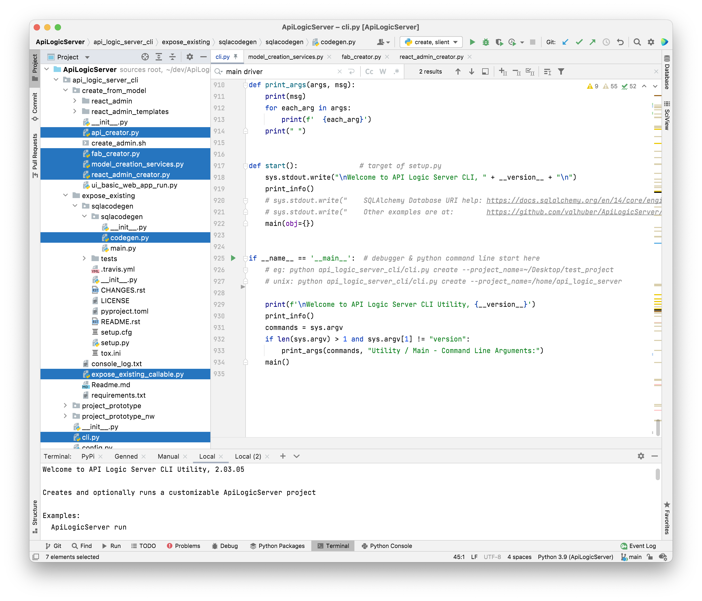

# ApiLogicServer

Creates a server project at <project_name>.

## Current Status

    Update 1/17 9AM
        generating server, windows & mac - IDE or Command Line
        server runs, mac (not windows)
        generated flask app builder runs (mac)


This version has only been run under PyCharm (which recall sets
PythonPath to make things easy).  The app is set up to run
```ApiLogicServer/create_server.py``` either
in debugger, or cmd-line. 

## How to Install it
Preliminary version - **run from IDE:**
Install as any typical project (I do this is PyCharm):

```
git clone https://github.com/valhuber/ApiLogicServer.git
cd ApiLogicServer
virtualenv venv
source venv/bin/activate
```

*Envisioned* to be used:
```
virtualenv venv
pip install ApiLogicServer
pip install -r requirements.txt  -- from where??
ApiLogicServer <project_name>
```


## How to generate the API Server

Install as any typical project (I do this is PyCharm):

```
cd app_logic_server
# run create_server.py from IDE
```
Currently hard-coded to create default project: ```Desktop/my_project```.
Expected log:
```
API Logic Server Creation 1.0.0

Delete dir: /Users/val/Desktop/my_project
Create Project with command: git clone --quiet https://github.com/valhuber/ApiLogicServerProto.git /Users/val/Desktop/my_project
Delete dir: /Users/val/Desktop/my_project/.git
Create database/models.py with command: python /Users/val/dev/ApiLogicServer/expose_existing/sqlacodegen/sqlacodegen/main.py sqlite:////Users/val/dev/ApiLogicServer/app_logic_server/nw.sqlite  > /Users/val/Desktop/my_project/database/models.py
Create ui/basic_web_app with command: flask fab create-app --name /Users/val/Desktop/my_project/ui/basic_web_app --engine SQLAlchemy
Create ui/basic_web_app/app/views.py and api/expose_api_models.py (import / iterate models)
Writing: /api/expose_api_models.py
Update api_logic_server_run.py, config.py and ui/basic_web_app/config.py with project_name and db_url
Writing: /ui/basic_web_app/app/views.py

Process finished with exit code 0
```


<figure></figure>

### How to generate from the Command Line
    
This is the expected usage.
It will be via ```pip``` in the future, but for now:

```
cd some_folder
cp <ApiLogicServer>/venv venv  # see sub-section below
source venv/bin/activate

# from arbitrary folder:
python /Users/val/dev/ApiLogicServer/app_logic_server/create_server.py --project_name=my-new-project

cd app_logic_server  # or from project files
python create_server.py --project_name=~/Desktop/test/my-new-project 
```

#### Issue setting PYTHONPATH
For now, the ```venv``` copy is required - I was unable to "push" PYTHONPATH to run ```expose_existing``` in ```run_command(cmd: str, env=None)```:
```
result_b = subprocess.check_output(cmd, shell=True, env=use_env)
```

## How to run the API Logic Server

```
cd ~/Desktop/my_project
virtualenv venv
source venv/bin/activate
pip install -r requirements.txt
python api_logic_server.py
```

This should now run, and return data.

## How to run Flask App Builder (FAB)
This is also running:

```
python ui/basic_web_app/run.py
```

    
# Next Steps

## Windows
Delete is failing, so the target generation folder must
not exist.  This also leaves the ```.git``` folder,
but not fatal.


##  Cleanup

I moved ```app``` module to ```api``` module... like?

Also, can we move ```admin``` under ```ui```?

## Engage Logic Bank
Not tried yet.  Look out for missing back_ref relationships.

## PIP Install / Operation
As customers will run.

## Try with other DBs, non-sqlite
These will probably fail in FAB,
since the admin data is not being created.

## Flask Admin
This is required to create tables for Users and Roles,
for FAB login.  Perhaps as an option.

```
cd my_project
echo $PYTHONPATH
PYTHONPATH="/Users/val/dev/my_project:$PYTHONPATH"
export PYTHONPATH

cd ui/basic_web_app
(venv)$ export FLASK_APP=app
(venv)$ flask fab create-admin
Username [admin]:
User first name [admin]:
User last name [user]:
Email [admin@fab.org]:
Password:
Repeat for confirmation:
```


